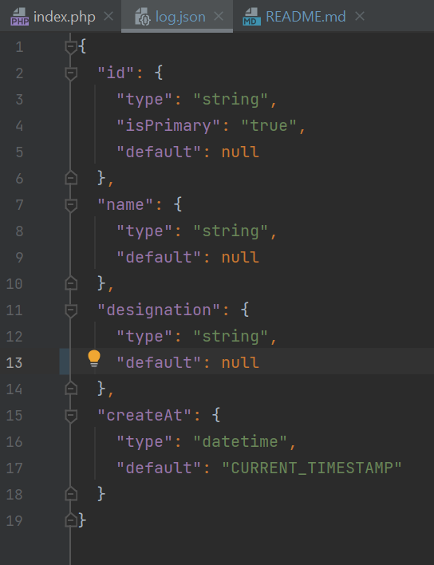
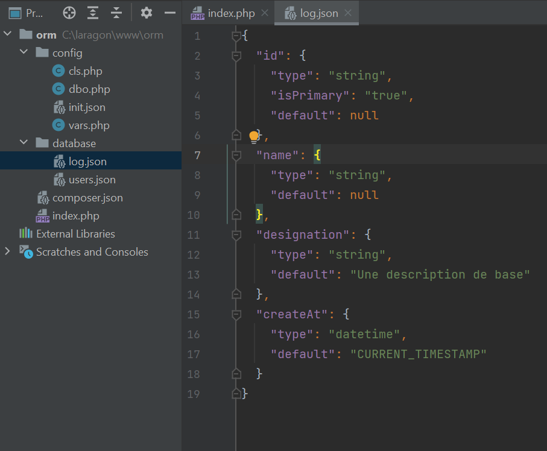

# orm-php
Une bibliothèque de code qui facilite la création et la modification des tables dans une base de données #mysql avec #PHP
<strong>Modele d'une table en format JSON</strong>


<h3>./database/log.json</h5>
<h4>Exemple</h4>




<strong>orm-php/index.php</strong>
```php
use Configurations\vars;
include './config/cls.php';
include './config/vars.php';
include './config/dbo.php';

$vars = new vars(true);
var_dump($vars->data_response);

```

 
  
